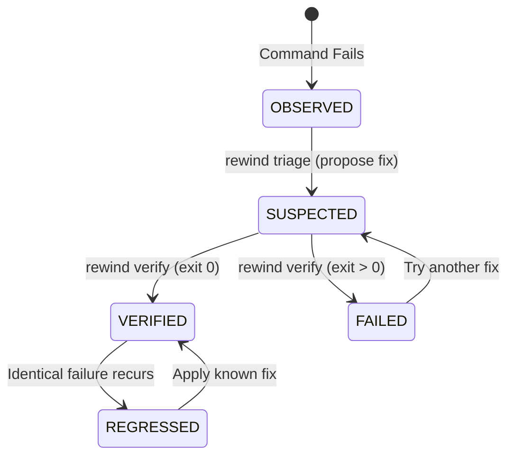

<div align="center">
  <!-- TODO: Replace with a real banner image -->
  <h1>⏪ Rewind CLI</h1>
  <p><strong>Remember what fixed it. A verified-recovery ledger for the terminal.</strong></p>

  [](https://www.npmjs.com/package/rewind-cli)
  [](https://github.com/Tejas3479/rewind-cli/actions)
  [](https://opensource.org/licenses/MIT)
  [](https://nodejs.org)
  [](https://www.npmjs.com/package/rewind-cli)

  <br />
  <em>Stop googling the same terminal errors. Capture failures, verify fixes, and build a permanent local memory of how your project works.</em>
</div>

---


## ⚡ Why Rewind?

We've all been there: a script fails, you spend 20 minutes debugging, you find the fix, and you move on. A month later, it fails again—and you've completely forgotten the solution.

**Rewind** is a zero-dependency CLI tool that lives in your project. It captures command failures, preserves forensic evidence (logs, git state, environment), and lets you record and *cryptographically verify* the fix. When that identical failure happens again, Rewind instantly surfaces the verified remedy.

### ✨ Key Features
* **Zero Dependencies:** Written purely in Node.js built-ins. Lightning fast, zero bloat, incredibly secure.
* **100% Local & Privacy-First:** Everything stays in your `.rewind` folder. No telemetry, no cloud syncing, no network requests.
* **Cryptographic Ledger:** Fixes are recorded in an append-only JSONL journal, sealed with SHA-256 hashes to guarantee integrity.
* **AI-Ready (MCP):** Exposes a Model Context Protocol server. Give your AI coding agents (Claude, Cursor) instant access to your project's historical failure memory.
* **Zero Auto-Execution:** Strict safety invariants. Rewind will *never* run historical fixes automatically.

---

## 🛠️ Typical Use Cases

| Scenario | How Rewind Helps |
| :--- | :--- |
| **Flaky CI/CD Scripts** | Record exactly which obscure environment variable fixes that one Docker build step that fails every 3 months. |
| **Onboarding New Devs** | Commit the `.rewind` folder. When a junior dev hits a known database seeding error, Rewind instantly tells them how your team fixes it. |
| **Agentic Coding Context** | Point Claude Desktop at the Rewind MCP server. The AI will read your project's past failures and stop making the same mistakes. |

---

## 🚀 Installation

Install globally via npm:

```bash
npm install -g rewind-cli
```

Initialize a ledger in your current project:
```bash
cd my-project
rewind init
```

---

## 📖 The Trust Loop: How It Works

Rewind doesn't just store notes; it enforces a strict state machine to guarantee that a fix actually works before committing it to memory.



### 1. Observe
Run commands through Rewind. Non-zero exits are automatically captured.
```bash
rewind run npm run build
```
*(Tip: Install [shell hooks](#-shell-integration) to capture failures automatically without typing `rewind run`!)*

### 2. Triage
Launch the interactive wizard to document the root cause and the fix applied:
```bash
rewind triage
```

### 3. Verify
Prove the fix works. Rewind runs your verification command; if it passes, the fix is permanently sealed as **VERIFIED**.
```bash
rewind verify <id>
```

---

## 💻 Commands Reference

| Command | Description |
| :--- | :--- |
| **Core** | |
| `rewind run <cmd...>` | Execute a command and capture failure evidence on non-zero exit |
| `rewind history` | View failure records and recovery ledger timeline |
| `rewind show <id>`| Inspect forensic failure snapshot, logs, environment, and diffs |
| `rewind search <q>`| Search historical failures by keyword, error text, or fingerprint |
| **Recovery** | |
| `rewind triage [id]` | Interactive 7-step guided recovery triage and verification wizard |
| `rewind recover <id>` | Record suspected cause, remediation change, and verify command |
| `rewind verify <id>` | Execute the approved verification command to validate the fix |
| `rewind patterns` | Analyze historical failures for flakiness and deterministic patterns |
| **Advanced** | |
| `rewind context` | Query structured forensic diagnostic context for coding agents |
| `rewind hook <shell>` | Generate passive failure-observation hooks (`bash`, `zsh`, `powershell`) |
| `rewind mcp` | Start Model Context Protocol (MCP) server |
| **Maintenance** | |
| `rewind doctor` | Run installation & ledger health audit with safe repair capability |
| `rewind verify-integrity` | Perform read-only cryptographic audit across hash chain |
| `rewind clear` | Safely wipe the local ledger |

---

## 🔌 Shell Integration

Skip typing `rewind run`. Install our passive shell hooks to catch failures automatically.

**Bash:** `eval "$(rewind hook bash)"` (Add to `~/.bashrc`)
**Zsh:** `eval "$(rewind hook zsh)"` (Add to `~/.zshrc`)
**PowerShell:** `Invoke-Expression (& rewind hook powershell | Out-String)` (Add to `$PROFILE`)

---

## 🤖 AI Agent Integration (MCP)

Rewind acts as long-term negative memory for AI coding agents. Tools like Claude Desktop or Cursor can search your project's historical failures to avoid repeating past mistakes.

Add this to your MCP client config (e.g. `claude_desktop_config.json`):
```json
{
  "mcpServers": {
    "rewind": {
      "command": "rewind-cli",
      "args": ["mcp"],
      "env": {
        "REWIND_ROOT": "/absolute/path/to/your/project"
      }
    }
  }
}
```

---

## 🛡️ Security & Privacy

1. **Redaction Engine:** Automatically strips secrets (AWS keys, GitHub tokens, passwords) from captured stdout/stderr and environment variables.
2. **Buffer Limits:** Strictly caps stream memory allocation to prevent resource exhaustion attacks.
3. **No Execution Without Consent:** Rewind never automatically applies historical fixes.

## 📄 License
MIT © Tejas
