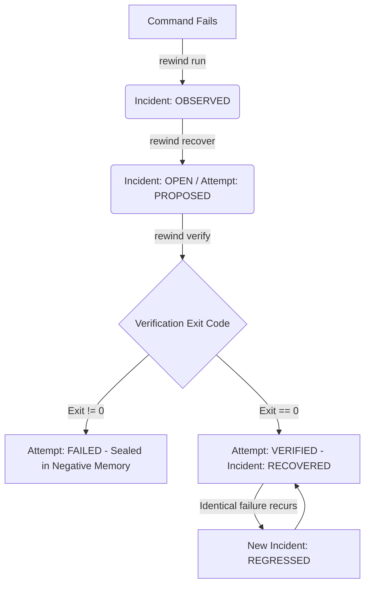

# rewind-cli

> Remember what fixed it. A verified-recovery ledger for the terminal.

[](https://www.npmjs.com/package/rewind-cli)
[](https://opensource.org/licenses/MIT)
[](https://nodejs.org)
[]()

Rewind is a zero-dependency developer CLI tool that captures command failures, preserves diagnostic evidence, tracks remediation steps, verifies recoveries through explicit user-approved commands, and recalls verified solutions when identical failures recur.

## Install

```bash
npm install -g rewind-cli
```

## Quick Start

```bash
# 1. Run a command that fails
rewind run node failing-script.js

# 2. Record what you think caused it and the fix you applied
rewind recover 1 \
  --cause "Connection pool size was set to 1 instead of 20" \
  --change "Increased pool size to 20 in database.config" \
  --verify-cmd 'node check-pool.js'

# 3. Execute the verification command to validate and seal the fix
rewind verify 1

# 4. Same failure recurs later -> Rewind instantly detects regression & surfaces the verified remedy
rewind run node failing-script.js
```

## How It Works



## Commands

| Command | Description |
| :--- | :--- |
| `rewind run <command...>` | Execute a command and record failure evidence on non-zero exit |
| `rewind history [options]` | View failure records and recovery ledger timeline |
| `rewind show <id> [options]`| Inspect forensic failure snapshot, logs, environment, and recovery status |
| `rewind triage [id]` | Interactive 7-step guided recovery triage and verification wizard |
| `rewind recover <id>` | Record suspected cause, remediation change, and explicit verification command |
| `rewind verify <id>` | Execute the user-approved verification command to validate and seal the fix |
| `rewind search <query...>`| Search historical failures by error message, keywords, or fingerprint |
| `rewind patterns [options]` | Analyze historical failures into deterministic, evidence-backed diagnostics |
| `rewind context [latest]` | Query structured forensic diagnostic context and remedies for coding agents |
| `rewind export-shared` | Export portable, sanitized recovery bundle for team sharing without Git |
| `rewind import-shared` | Import verified knowledge from a shared recovery bundle |
| `rewind hook <shell>` | Generate passive failure-observation hooks for Bash, Zsh, or PowerShell |
| `rewind doctor [options]` | Run installation & ledger health audit with safe repair capability |
| `rewind verify-integrity` | Perform read-only cryptographic audit across hash chain and checkpoints |
| `rewind rebuild [options]`| Reconstruct derived incident projection records from the authoritative journal |
| `rewind mcp` | Start Model Context Protocol (MCP) server for AI agents |
| `rewind help` | Show help information |
| `rewind version` | Show version |

## Shell Integration

Rewind includes optional, zero-dependency shell hooks for Bash, Zsh, and PowerShell. These hooks allow normal commands to execute naturally without requiring the `rewind run` prefix, while automatically capturing failures when non-zero exit codes occur.

**Bash**
Add to `~/.bashrc`:
```bash
eval "$(rewind hook bash)"
```

**Zsh**
Add to `~/.zshrc`:
```bash
eval "$(rewind hook zsh)"
```

**PowerShell**
Add to `$PROFILE`:
```powershell
Invoke-Expression (& rewind hook powershell | Out-String)
```

## AI Agent Integration

Rewind provides a Model Context Protocol (MCP) server that AI coding agents (like Claude Desktop or Cursor) can use to safely access your project's historical failure memory.

Add to your MCP client config:
```json
{
  "mcpServers": {
    "rewind": {
      "command": "rewind",
      "args": ["mcp"]
    }
  }
}
```
See [AGENT_INTERFACE.md](./AGENT_INTERFACE.md) for full context integration details.

## Architecture

Rewind uses a strict event-sourcing architecture:
- **Append-only cryptographic event journal**: Every lifecycle mutation is cryptographically sealed.
- **SHA-256 chain hashing**: Protects against accidental corruption, deleted events, and rewrites.
- **Zero dependencies**: Written purely with the Node.js standard library.
- **Disposable derived projections**: Local records and search indices are pure functions of the immutable ledger and can be rebuilt deterministically.

## Contributing

We welcome contributions! Please see [CONTRIBUTING.md](./CONTRIBUTING.md) for guidelines on how to get started, run tests, and format your code.

## License

MIT © Tejas3479 (See [LICENSE](./LICENSE))
